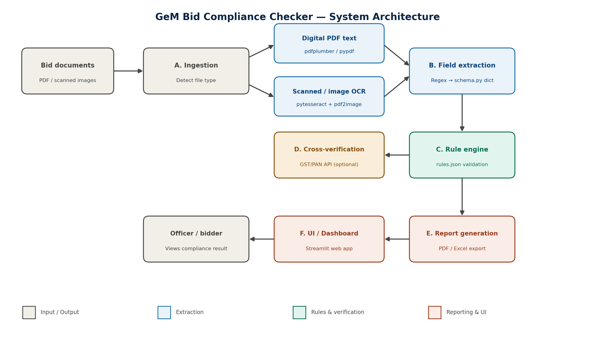

# GeM Bid Compliance Checker (SIH26100)

**Smart India Hackathon 2026** | Ministry of Petroleum & Natural Gas | Theme: Smart Automation

## Problem
Government officers manually verify dozens of bid documents (GST, PAN, MSME certificates)
on the GeM portal — a slow, repetitive, error-prone process.

## Solution
An automated pipeline that extracts key fields from uploaded bid documents, validates them
against compliance rules (format, expiry, cross-document matching), and generates an
instant pass/fail report with reasons — reducing manual review time from ~30 minutes to
under a minute per bid.

## Live Demo
🔗 [Add your Streamlit Cloud link here once deployed]

## Architecture

## Tech Stack
- Python, Streamlit
- pdfplumber, pytesseract (OCR)
- reportlab, openpyxl (report export)

## How to Run Locally
\`\`\`bash
git clone https://github.com/fahad-0711/gem-bid-compliance-checker.git
cd gem-bid-compliance-checker
python -m venv venv
venv\Scripts\Activate.ps1
pip install -r requirements.txt
streamlit run app/app.py
\`\`\`

## Sample Test Data
Try uploading files from `data/sample_docs/valid/`, `invalid/`, or `missing/` to see
different compliance outcomes.

## Team
- [Your name] — Extraction, Rules, Integration, UI

## Government Record Verification (Simulated)
This feature demonstrates how document verification against official
government databases would work. Since real GST/PAN/MSME government APIs
require official access and involve confidential data, we simulate this
using a small set of sample records we created ourselves — no real
government or personal data is used. In production, this module would
be replaced with live calls to GeM/Income Tax/Udyam verification APIs.

## Known temporary limitation
GST is currently NOT included in mandatory document checks, pending
real-world GST certificate images for testing. PAN and MSME verification
are fully functional. Re-enable GST by adding it back to
`mandatory_documents` in `rules/rules.json` once test images are available.